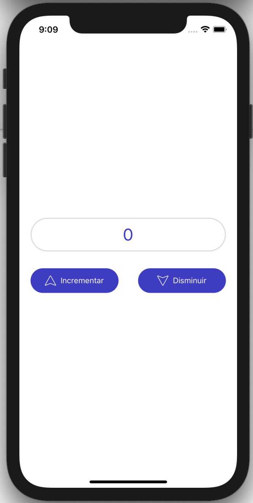

# React Native Redux Examples

This repository contains the implementation of a simple React Native application developed across several blog entries at [julioecheverri.com](http://www.julioecheverri.com).

The content of this repository is mainly intended to illustrate some basic skills on **configuring**, **managing**, **persisting** and **monitoring** a simple **Redux** state on our _React Native Application_.

### The Application
The app we develop in this repository consists on a **counter** that increases or decreses its value based on two buttons that the user can press at any time (see UI below).

The app works this way:

### This implements the following branching rules:

- Each branch implements a specific feature/tutorial from [julioecheverri.com](http://www.julioecheverri.com).
- All branches in this repo are related to Redux and they are respectively linked in the corresponding [julioecheverri.com](http://www.julioecheverri.com) post.
- The `main` branch keeps the latest changes in the repository, i.e. the most advanced version of the example app is found in this branch.

### Branches description

- #### adding-redux:
  In this branch we add `redux`, `redux-recompose` and `react-redux` to our newly created React Native (Typescript) project. In this branch the app implements a basic counter that increase/decrease based on two buttons that dispatch a basic action to Redux and updates the counter.
- #### redux-reactotron:
  In this branch we install and configure `Reactotron` to monitor the _Redux_ state and log info from the app.
- #### redux-persistence:
  In this branch we configure and manage Redux state persistence in the device's filesystem using `async-storage` and `reedux-persist`.
  
  
  
 **Copyright**
 Julio César Echeverri Marulanda
