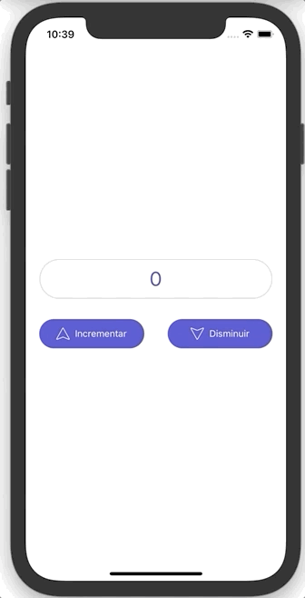

# React Native Redux Examples

This repository contains the implementation of a simple React Native application developed across several blog entries at [julioecheverri.com](http://www.julioecheverri.com).
This is mainly intended to learn about some basic skills on configuring, managing, persisting and monitoring **Redux** state on the _Reeact Native App_.

A simple mobile application is implemented, just a counter app that increases or decreses the value based on button events (see UI below).

The app works like this:

This implements the following branching rules:

- Each branch implements a specific feature/tutorial from [julioecheverri.com](http://www.julioecheverri.com).
- All branches in this repo are related to Redux and they are respectively linked in the corresponding [julioecheverri.com](http://www.julioecheverri.com) post.
- The `main` branch keeps the latest changes in the repository, i.e. the most advanced version of the example app is found in this branch.

## Branches in this repo and the corresponding description

- #### adding-redux:
  In this branch we add `redux`, `redux-recompose`, `react-redux` to our newly created React Native (Typescript) project. In this branch the app implements a basic counter that increase/decrease based on two buttons that dispatch a basic action to Redux and updates the counter.
- #### redux-reactotron:
  In this branch we install and configure `Reactotron` to monitor the _Redux_ state and log info from the app.
